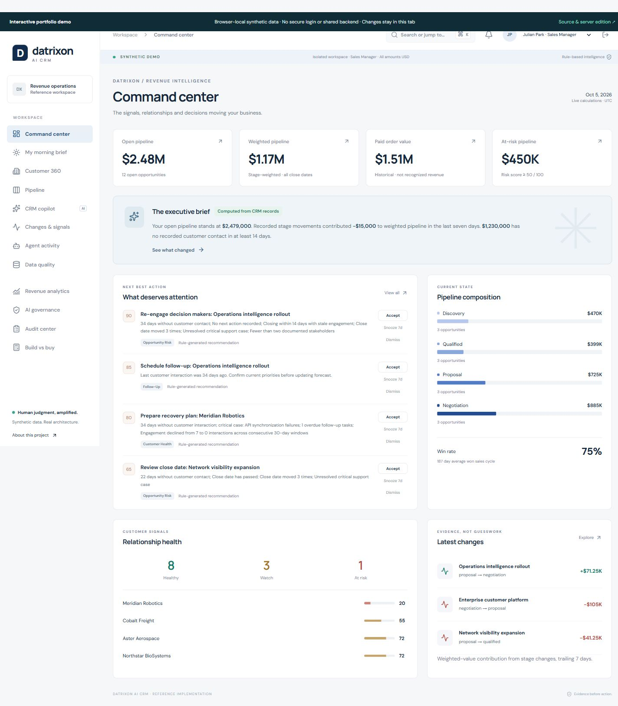
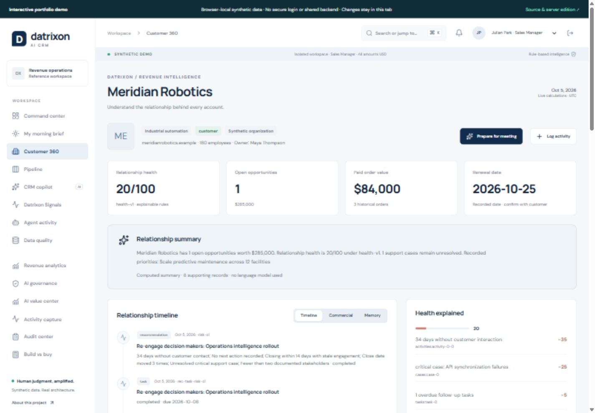
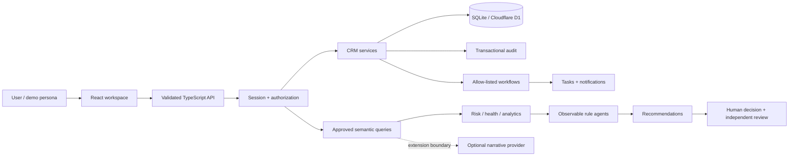

# Datrixon AI CRM

### AI-native customer intelligence & revenue operations

**[Live demo on GitHub Pages](https://jithendra-data.github.io/datrixon-ai-crm/) · [Validation & deployment](https://github.com/Jithendra-data/datrixon-ai-crm/actions)**

**Traditional CRMs capture data. Datrixon interprets records, explains changes, identifies risk and puts the next useful action in front of a person.**

A working portfolio/reference implementation combining a relational customer model, deterministic intelligence, observable agents and explicit human decisions. This is a separate project from [Datrixon ERP Intelligence](https://github.com/Jithendra-data/datrixon).

**[Overview](docs/00-overview.md) · [Architecture](docs/03-architecture.md) · [Demo guide](docs/21-demo-guide.md) · [Security](SECURITY.md) · [Limitations](docs/22-limitations.md)**

> All organizations, people and business records are synthetic. This is not a certified Salesforce replacement, an enterprise production deployment, or evidence of measured cost savings. The working copilot and agents are deterministic; an external language model is not connected.

## Two runnable editions

- **GitHub Pages:** browser-local SQLite/WASM demonstration, with working workflows and synthetic data. No shared backend or secure login.
- **Server reference:** the same CRM services behind validated HTTP APIs, SQLite/D1, server-enforced roles and session security.

Public hosting uses GitHub Pages, not ChatGPT Sites. See [deployment details](docs/20-deployment.md).

```bash
npm ci
npm run build:pages
npm run preview:pages
```

## Why this exists

CRM adoption suffers when a system asks for more data entry than it gives back in useful decisions. Fragmented communication, stale deals, duplicate contacts and opaque forecasts compound the problem. What should a CRM look like when customer intelligence and governance are designed together from the beginning?

The answer is deliberately focused: clean relationships, useful signals, traceable calculations and accountable decisions. Custom software can fit an organization's workflows; it also creates continuing engineering, security and support obligations.

## See the product



| Working surface     | What it does                                                                                                        |
| ------------------- | ------------------------------------------------------------------------------------------------------------------- |
| Command center      | Computes open/weighted pipeline, paid orders, risk exposure, health and an evidence-based executive brief           |
| Customer 360        | Joins contacts, activities, notes, cases, tasks, opportunities, orders, products, stage history and recommendations |
| Pipeline            | Kanban and analytical views; create deals; edit stage, next action and close date with optimistic version checks    |
| CRM copilot         | Routes supported questions to approved semantic queries; shows sources, logic and limitations                       |
| Changes & signals   | Attributes weighted-value changes to recorded stage movements, with the arithmetic                                  |
| Agents & actions    | Eight rule agents; persistent run logs; accept, dismiss, snooze and complete recommendations                        |
| Governance          | Role enforcement, independent planning approval, workflow controls and an audit center                              |
| Data quality        | Duplicate candidates, missing ownership/contact data, stale deals and overdue close dates                           |
| Meeting preparation | Grounded brief and durable CRM memory with timestamps and source references                                         |
| Build vs buy        | Editable license, implementation, infrastructure, AI, maintenance, security and switching assumptions               |



## Architecture in one minute



**Stack:** TypeScript strict mode, React 19, Next.js App Router conventions on the Vinext/Cloudflare Worker runtime, SQLite/D1, Drizzle migrations, Zod, Lucide, Node test runner and GitHub Actions. The responsive CSS is purpose-built. No separate warehouse or queue is needed for the bounded reference dataset.

SQLite/D1 enables local and hosted persistence without a database server. PostgreSQL is the documented next step for enterprise identity, larger datasets, row-level security, CDC and heavier analytics. This repository does not pretend to support both databases today.

## Run locally

Requires **Node.js 24** and npm. No API key or Docker daemon is needed.

```bash
git clone https://github.com/Jithendra-data/datrixon-ai-crm.git
cd datrixon-ai-crm
npm ci
npm run build
npm run db:migrate
npm start
```

Open the local URL printed by Wrangler and choose **Start the interactive demo**. This creates an isolated synthetic workspace and a 24-hour HttpOnly session. Switch personas using the header selector. The initial persona is Julian Park, Sales Manager.

For development after the first migration: `npm run dev`.

Docker configuration is included in [docker-compose.yml](docker-compose.yml); it was not executed in the authoring environment because the Docker engine was unavailable.

## Five-minute walkthrough

1. Select a command-center metric to inspect its formula and lineage.
2. Open Meridian Robotics. Review health factors, timeline and stakeholders; generate a meeting brief.
3. Ask the copilot **“Why did forecasted revenue decline?”** Inspect stage-change evidence.
4. Edit a pipeline deal's next action. Verify its audit event and stage history.
5. Accept a recommendation, then switch to Elena Vasquez, Executive, for independent planning approval. No email or commercial mutation occurs.
6. Run workflows from Governance and inspect Notifications. Switch to Analyst and verify mutation restrictions.

## Intelligence with an explicit trust boundary

Risk and health are explainable heuristics, not trained probabilities. Forecast categories overlap and must not be summed. Paid order value is not GAAP recognized revenue. Stage-history attribution is not a complete period-over-period forecast snapshot.

The copilot never generates SQL or gets database credentials. Unknown questions fail closed. The `NarrativeProvider` interface and OpenAI-compatible adapter are extension points; provider configuration, secrets and output validation need further integration. No API key is shipped to the browser.

Implemented agents: Opportunity Risk, Customer Health, Follow-Up, Pipeline Hygiene, Duplicate Detection, CRM Data Quality, Lead Qualification and Forecast. “Agent” means an observable analytical module, not an autonomous LLM with unrestricted tools.

## Data & security

The **36-table relational model** includes CRM entities, junctions, stage history, governance, sessions and quota counters. Currency uses integer USD cents. Workspace IDs participate in core entity keys and foreign keys. Interactions share one activities table; ownership is a user relationship.

The server edition’s controls include prepared statements, Zod allow-lists, server-side roles and account scope, hashed random session tokens, HttpOnly/SameSite cookies, origin checks, bounded requests, quotas, optimistic concurrency and transactional audit writes. No uploads, arbitrary SQL, email sending or automatic merges are exposed.

**Persona switching is not enterprise authentication.** All visitors operate only on isolated synthetic workspaces. SSO/MFA, retention scheduling, immutable audit exports, load testing and an independent security assessment remain production gates. See [RBAC](docs/13-rbac.md).

## Engineering & validation

```bash
npm run lint
npm run typecheck
npm test
npm run format:check
npm run build
npm run db:migrate
# With npm start running:
npm run test:smoke
```

Tests use real SQLite migrations and transactions: authorization denial, tenant foreign keys, rollback, session expiry, version conflicts, approval separation, idempotent workflows, quality rules, analytics and deterministic AI fallback. GitHub Actions repeats installation, checks, build, migration and HTTP smoke validation. See [testing](docs/19-testing.md).

## Repository map

```text
app/                 Public homepage, workspace routes and HTTP boundary
components/crm/      Product views and reusable UI
lib/crm/             Domain services, authorization, agents and calculations
db/                  Relational schema
drizzle/             Generated migrations and snapshots
tests/               Unit and real SQLite integration tests
scripts/             Migration, seed and HTTP smoke tools
docs/                Product, architecture, governance and portfolio narrative
static-demo/        GitHub Pages entry, browser SQLite transport
build/, vendor/      Server-edition Worker build integration
.github/workflows/   CI quality gates
```

## Decisions and remaining work

Evidence and maintainability take priority over breadth. Leads, campaigns and quotes have a relational model; their management workflows are narrower than a full CRM. No live inbox/calendar ingestion is configured. Workflows run on demand. No claim is made that this replaces every CRM workflow.

See [documentation](docs/00-overview.md), [decisions](docs/24-design-decisions.md), [roadmap](docs/23-roadmap.md) and the [interview narrative](docs/portfolio-story.md). MIT licensed; see [LICENSE](LICENSE), [CONTRIBUTING.md](CONTRIBUTING.md) and [SECURITY.md](SECURITY.md).
