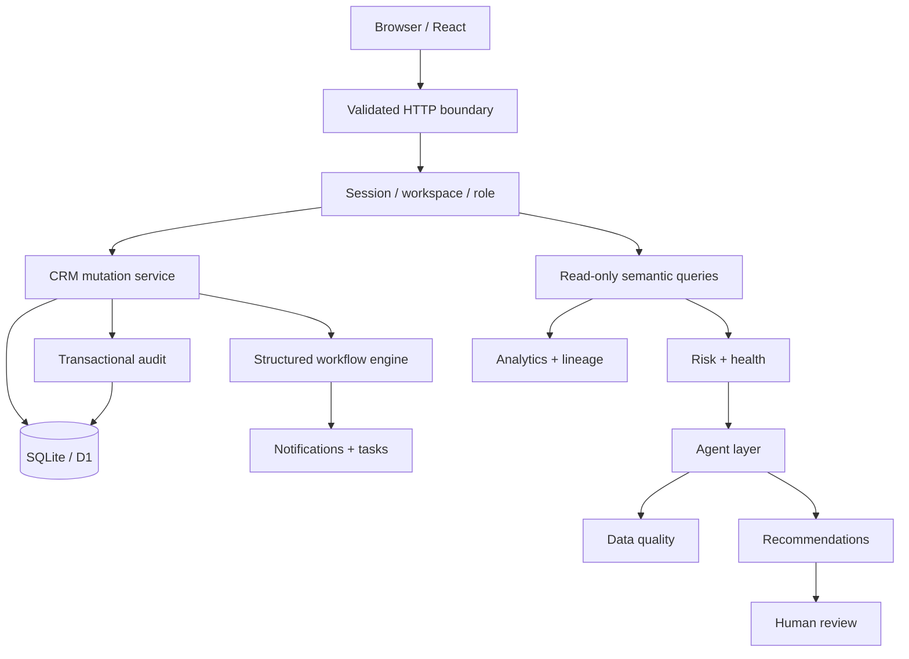
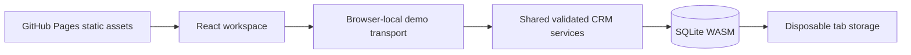

# Architecture

> **Deployment boundary:** the public GitHub Pages demo uses browser-local SQLite and synthetic data. Role controls and audits there are simulations, not security boundaries. Server enforcement described in this document applies to the runnable server edition in this repository. See [Deployment](20-deployment.md).

A modular TypeScript monolith runs as a Cloudflare Worker. React uses App Router conventions through Vinext. Full document links avoid reliance on experimental client RSC navigation. Marketing and CRM share one artifact.

The HTTP route owns transport, cookies, quotas and error responses. The service owns authorization, validation and transactional mutations. The repository owns database access. Pure intelligence modules operate on scoped datasets. UI visibility is never the authorization boundary.

SQLite/D1 supports real persistence without a database server. Reads are bounded to 2,000 rows per operational table and fail rather than silently truncate. Production scale needs resource pagination, database-side aggregation and potentially PostgreSQL plus an analytical replica. A service mesh, queue and warehouse would add operating cost without improving the current demonstration.

## Public GitHub Pages distribution

There is no trusted server in this distribution. The browser owner can inspect or modify all data and persona state. The Worker edition above demonstrates enforced boundaries; the Pages edition demonstrates product workflows without requiring backend credentials. Both editions share migrations, scoring, semantic queries and mutation rules.

## Intelligence boundary

Historical account frames and current scoped records feed pure attribution/Signals functions. Structured memory uses source-version fingerprints. Ingestion commits activity, provenance, participant link, memory and observation together. Model narration is injected by the server route through a provider interface; the shared browser service has no configured provider. New modules are `history`, `memory`, `ingestion`, `priorities`, `narrative` and `narrative.server` under `lib/crm`.
