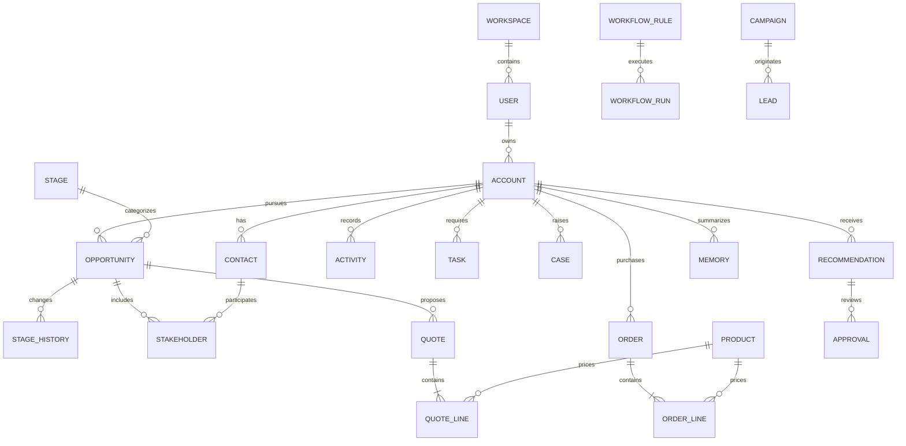

# Data model

The authoritative [schema](../db/schema.ts) has 36 tables with generated Drizzle migrations. CRM keys are `(workspace_id,id)`; core relationships use composite foreign keys. Currency is integer USD cents. Timestamps, source and metadata are standard; lifecycle and ownership are explicit where meaningful.

Teams and territories classify ownership. Tags use an account junction. Data sources record provenance. Agents, recommendations, approvals, workflows, notifications, audit, quality, memory and AI requests provide traceability. Sessions and quota counters protect the demo.

Owners are users, not a redundant table. Interactions are typed activities rather than duplicate timelines. Quotes/orders have line items. Leads/campaigns are modeled synthetic context; full marketing execution is not implemented. The relationship map is a compact account-contact view.

Core relationships reject cross-workspace references. Some ancillary actor/evidence references remain strings requiring application checks; universal FK coverage is not claimed. JSON metadata is supplementary, not a replacement for normalized commercial fields.
