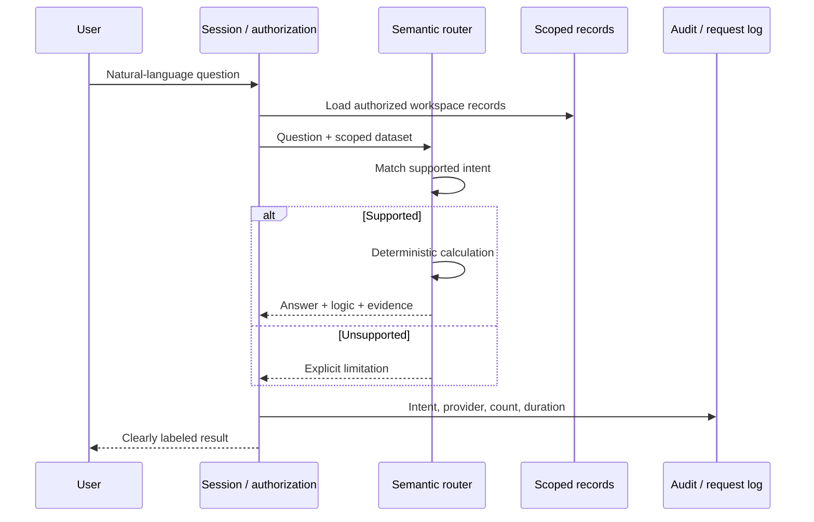

# AI architecture

The working assistant supports account summaries, deal risk, inactivity, revenue ranking, forecast movement, rep activity and next actions. It is semantic routing, not unrestricted conversation. No model receives database access or generates SQL.

`NarrativeProvider` is an optional interface. The OpenAI-compatible adapter accepts a server-configured endpoint, secret, model and abort signal. It sends constrained evidence, has no tools and limits output. It is not connected to the live route. Native Anthropic needs another adapter; compatible local gateways can implement the interface.

Before enabling narration, add server environment validation, endpoint allow-listing, deadlines, budgets, output validation and provider-failure tests. Keep computed facts separate from generated wording. Notes are untrusted data. A prompt is not a security boundary; absence of tool authority is the stronger boundary. No provider call is needed for current CRM functionality.
