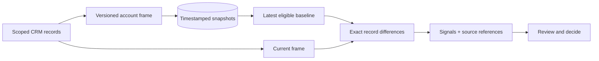

# Datrixon Signals and historical evidence

Datrixon follows four steps: **Understand** the relationship, **Detect** a change, **Explain** its evidence and business exposure, then **Act** through an accountable human decision.

The Signals page offers Revenue, Pipeline, Customer, Risk, Forecast, Relationship, Data Quality and Operational categories, severity filtering, period selection, source IDs and recommended next steps. An empty category means no matching evidence. Exposure is associated opportunity value, not predicted loss. Current relationship coverage conditions are explicitly distinguished from measured changes.

## Historical model

`intelligence_snapshots` stores versioned JSON frames per account with capture ID, timestamp and method. Frames contain opportunity value, stage probability, close date, risk factors, health factors, quality finding IDs and paid-order totals. The schema is validated before comparisons. Invalid or missing frames are excluded, never reconstructed as observations.

For each accessible account, choose the latest frame **at or before** the requested UTC boundary (yesterday, seven days ago, Monday or current quarter start). Compare that frame with current records. The UI reports coverage and exact baseline timestamps. Accounts without an eligible baseline are excluded from both totals. A baseline can precede the requested boundary; this is explicitly disclosed.

The demo seeds three authored synthetic scenario baselines (14, 7 and 1 days ago), clearly marked **synthetic scenario baseline**. These are illustrative scenario states, not recovered historical facts. Existing browser workspaces are migrated without invented backfill. Use **Capture current observation** to store their first baseline. Email capture stores a new frame in the same transaction. Other edits appear in the current side of comparisons; they do not automatically create snapshots. There is no background scheduler.

## Exact arithmetic

For each opportunity: contribution = current metric value − baseline metric value. Sum all contributions to obtain the net change. Values use integer USD cents. Weighted values use the stage probability; current-quarter forecast includes only open opportunities whose close date falls in the current UTC quarter, applying that same quarter to both states. Paid order value uses paid order lines, not recognized revenue. Closed-won value is the current stored won state, not a revenue recognition ledger.

Drivers identify amount, stage, close-date and risk changes. This is record-level attribution, not a causal model or a decomposition of simultaneous field effects. Health/risk factor changes identify new, resolved and changed rules; clipping at 0–100 can make factor deltas differ from the final score delta.

The bounded reference loader caps each table at 2,000 rows; manual observations stop before 1,800 snapshot rows. A production system needs retention, scheduling, archival, incremental reads and account lifecycle coverage beyond this bounded demo.
